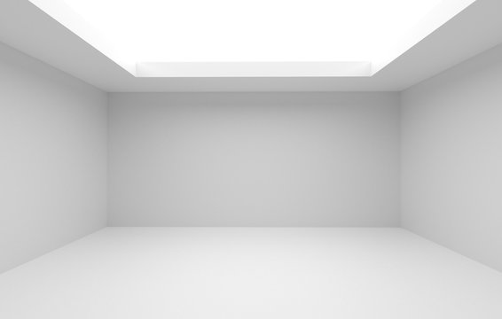
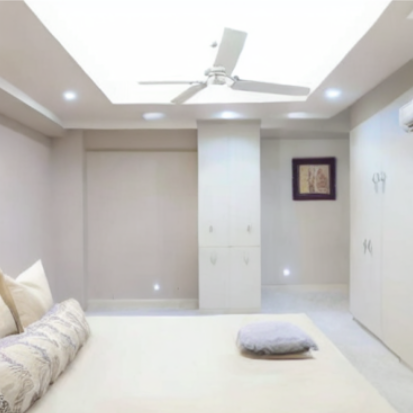
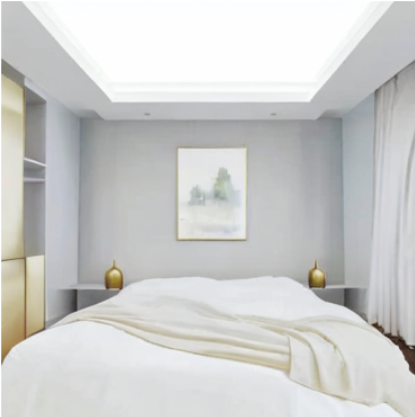
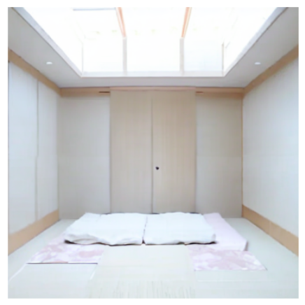
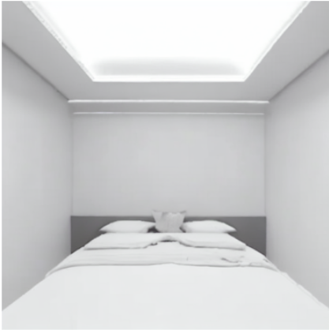

# AI Room Redesigner

An AI-powered interior design assistant that transforms room images into different design styles using Stable Diffusion Img2Img.

## Overview

This project allows users to upload an image of a room and generate redesigned interiors in various styles using Generative AI. The system leverages Stable Diffusion to create visually appealing room transformations while preserving the original room layout.

## Features

- Upload any room image
- Generate multiple interior design styles
- AI-powered image-to-image transformation
- Fast experimentation using Google Colab
- Realistic and creative room redesigns

## Technologies Used

- Python
- Stable Diffusion
- Diffusers
- PyTorch
- Hugging Face
- Google Colab
- PIL (Python Imaging Library)

## Example Results

### Original Room

---

### Modern Style

---

### Luxury Style

---

### Japanese Style

---

### Minimalistic Style

## How to Run

1. Open the notebook in Google Colab using the button above.
2. Run all setup and installation cells.
3. Upload a room image.
4. Enter the desired interior design style prompt.
5. Generate the redesigned room.

## Future Enhancements

- More interior design styles
- Web-based user interface
- Real-time room customization
- Furniture-specific editing
- High-resolution image generation

## Author

**Dhanush HM**

Computer Science and Engineering Student  
Interested in Artificial Intelligence, Machine Learning, and Generative AI.
